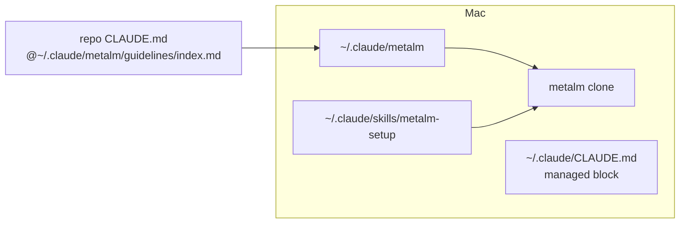

# Distribution

Status: DRAFT — not yet ratified by the owner.

Requirements: [../requirements/metalm.md](../requirements/metalm.md) (MLM-6, MLM-7)

## Reference, never copy

- metalm is the single source of truth. Repos hold no digest or copy of a guideline.
- `install.sh` symlinks `~/.claude/metalm` → the clone, and `~/.claude/skills/<skill>` → `skills/<skill>`.
- Each repo's `CLAUDE.md` holds `@~/.claude/metalm/guidelines/index.md`. The path is the same for every user, so the committed file is portable.
- `index.md` is loaded every session and cached; topic guidelines are read on demand.
- Update = `git pull` in metalm. Nothing to reinstall.

**Why:** a digest or copy drifts from its source; one file edited once does not.

**Rules out:** vendored copies; a generated per-repo digest; plain links nobody loads.

## Global CLAUDE.md block

- `install.sh` owns one block between `<!-- metalm:begin -->` and `<!-- metalm:end -->` in `~/.claude/CLAUDE.md`. It replaces only that block.
- The block says metalm governs, and maps "set up a repo" / "make the repo compliant with guidelines" to `metalm-setup`.

**Why:** another user running the installer gets their own block pointing at their own clone.

**Rules out:** hand-maintained pointers in the global file.

## Cloud sessions (not supported yet)

- `~/.claude/metalm` does not exist in cloud sessions, so the import fails there.
- When cloud sessions are needed: add metalm as a git submodule at `.metalm/` in each repo, pinned to a commit; `CLAUDE.md` imports `@.metalm/guidelines/index.md`; update with `git submodule update --remote` (a pointer bump, not a copy).
- Cost: submodule friction in every clone.

## Changes

- 2026-10-03 Created from the grilling session; submodule recorded as the cloud-session path.
