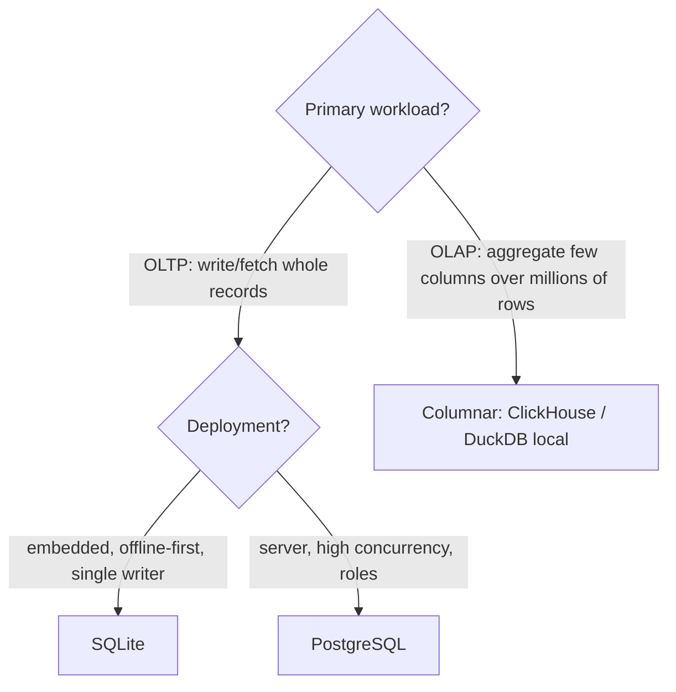

# Architecture

Status: DRAFT — not yet ratified by the owner.
Scope: what a good design looks like — principles, OOAD patterns, concurrency, state machines, storage. Read before writing or reviewing a design. How to document it: `design.md`. Config vs state files: `coding.md`.

## Principles

### Surfaces and stores
- One typed API module holds behaviour; CLI, MCP, pages, skill are logic-free surfaces with a parity test (see coding.md). CLI first, with a skill from day one; an agent-driven workflow is never the primary tool; no business logic in prompts. MCP only when a shell-less client needs it.
- One store is the truth (SQLite on a single Mac); state never lives in two places; every surface reads and writes it through the API. No database until a query needs a join. Pages write through the same API as the CLI; enforce rules in the API, not by hiding UI.
- Extension points are declared data (a registry entry, config line, layout): a new kind is an entry, never a branch in the orchestrator. Kinds with typed attributes live in a config table; adding one is a config edit; an unknown kind is allowed with a warning. Alternate input modes are parallel paths producing the same artifact.
- Producer and consumer never import each other; they meet at one hand-off. Never write into another system's state; reach it through one adapter. Reuse house patterns from sibling repos before proposing a library; name where the pattern lives. No forced code sharing: app-local first, shared package only when two consumers need the same behaviour today; but do not argue "small today" against reusing a rich existing system when growth is expected (a mutual dependency is acceptable for now).

### Deterministic over LLM
- The LLM has a short list of jobs (extract, draft, propose, explain); everything else is deterministic code. The LLM never ranks, decides a value, invents parameters, or types timestamps/links.
- Deterministic passes first, one tight model question last; the LLM receives their protected vocabulary as law; deterministic checks push on every change, generative work is pulled on request.
- LLM output is quarantined as proposals until a human accepts; it never writes declared/confirmed knowledge. Output outside the declared vocabulary is dropped and counted, never coerced.
- Extracted items carry a verbatim anchor matched against source; unmatched ones dropped and counted. Extraction is the index, source text the authority: citations may cite only loci that appeared upstream; import drops and counts the rest. The architecture survives a model change; no unlogged model call.

### History and identity
- History is immutable: committed revisions, evidence, decisions are append-only ledgers (who, when, why; reason required). Undo/restore writes forward as a new entry.
- Pick one history pattern per kind: master data mutable with a field-level change log by trigger; evidence append-only (date is the version); revisions as header + rows written only on commit; what-ifs computed, never stored.
- Evidence is withdrawn with a reason, never deleted. Derived values are computed, never stored; a contradiction raises. Persist only what cannot be reconstructed; caches key on every input that changes the result.
- Identity is a content hash of what was judged; approvals key on it, so cosmetic changes never reopen a gate and edits keep lineage (new hash → old hash). Recipe: SHA-256 of canonical JSON, fields sorted, id column excluded, type included; keys only name slots; renumbering never recomputes.
- Versions are immutable snapshots; movable tags (`final`) point to one; approvals travel across versions by content hash; never use versions as working directories.
- Author decisions are never lost in silence or regenerated underneath the author: stale ones stay visible until acknowledged; regeneration needs explicit `--force`. Every expert decision (rejection, correction, exemplar) is recorded as evidence and re-enters future prompts; never ask the same question twice. Never enforce a taste rule against the author; never auto-restore what the author removed.

### Provenance and facts
- Every fact carries provenance (source, date, producer: raw / deterministic / LLM / human). Unknown is recorded as UNKNOWN, never guessed; with no evidence the next action is "ask". Measure the material; config never overrides a measured fact. Evidence discipline for external claims: source URL, retrieval date, confidence tag; each finding says what it shapes; vendor claims with no stated method are low confidence; tool surveys record stars/last-push from the API with the date and flag tools that are not open source.
- Require agreement of independent sources (two of three signals; one proposes, another confirms).
- Author's words win: an author edit is approved on save and its provenance flips to human; show provenance mnemonics (e.g. B book, T thesaurus, H human, A model).
- Record facts and metadata from day one, before they matter (language, track fetched, suggested price), so a later decision is about data, not taste; a deferral states its reason.

### Workflow
- With no manual workflow to copy, automate industry-standard practice, not a bespoke style. Human review is a first-class pipeline stage with its own time budget.

### Workspace
- Runtime state lives outside the repo in one workspace dir (default `~/.<app>`, or a pointer in gitignored `.env`); project config stays in the repo.
- Only `setup` creates the workspace or writes the pointer. A missing workspace/DB/volume is a loud error; never mkdir or create an empty DB silently.

### Safety and failure
- Nothing outbound (send, upload, publish, spend, order) happens without an explicit command; print what will be sent and wait for `--yes`; never decide on the owner's behalf.
- Degradation announces itself: fall back with a visible notice; partial failure skips the unit loudly and builds the rest.
- Never eager: worst-case damage bounded by construction; when in doubt leave content in. Safety in layers: structural invariants, a manifest of applied AND rejected actions, an LLM tripwire; risky items default to REJECTED unless a human approves. When attribution is ambiguous, pause instead of acting (pausing is safe to get wrong; selling is not).
- Every hard guard is paired with a proposal channel; "settled" means the expert decides again, not never again.
- Earn complexity: simplest defensible start; no fallback for a condition that measurably does not occur; a fallback must cost nothing to keep alive.

## OOAD patterns (use when)
- Adapter: wrapping any external service behind a port.
- Strategy: several interchangeable algorithms/providers chosen by config (model per role, writer per format).
- Repository: one module owns reads/writes of a store; nothing else opens the DB or JSON directly.
- Command: each verb is a typed request object handled by the API; enables CLI/MCP/HTTP parity, logging, replay.
- Pipeline: ordered stages, each a pure-ish function from fingerprinted inputs to an atomically written artifact, with a skip guard.

## Active Objects (actors)

- Mechanism: isolated state, no shared memory, async event queue per object, run-to-completion handling of each event.
- Use when: orchestrating concurrent pipelines, decoupling components, removing mutexes and deadlocks.
- Leave alone: data-parallel array processing (queue overhead) and simple linear automation; a plain function or pipeline wins there.

## Hierarchical state machines (HSMs)

- Mechanism: nested UML statecharts; substates inherit parent transitions.
- Use when: state explosion threatens, behavior depends on context, or entry/exit must acquire and release resources strictly.
- Draw every HSM as a Mermaid `stateDiagram-v2` with composite states; the diagram and the code use the same state names.
- Leave alone: a two- or three-state flag; an enum is enough.

## Patterns that complement actors and HSMs

- **Strategy:** inject stateless algorithms into states, so a state's logic stays independent of the algorithm.
- **Factory / Builder:** construct complex active objects and their nested HSMs before they start and are injected into the runtime.
- **Observer (pub/sub):** the event-routing layer. Actors subscribe to topics; the bus routes external async events into each actor's queue.

## Libraries

| Language | HSM | Actor runtime |
|---|---|---|
| Python | `transitions` (nested states), `miros` (QP port) | `miros`; or `asyncio` task + `Queue` per object |
| JS/TS | `XState` (SCXML-based, actors + HSMs) | `XState` |
| Rust | `statig`, `finny` | `Actix`, `Embassy` (embedded) |
| C/C++ | `QP/C`, `QP/C++` (embedded baseline) | same |

## Database selection

- Row-based (PostgreSQL, SQLite) to write or fetch whole records; column-based (ClickHouse; DuckDB when local) for aggregations over many rows and few columns.
- SQLite for embedded, offline-first, single-writer apps. PostgreSQL for high-concurrency server deployments needing strict ACID under many writers and role-based access.
- **Local vs managed:** `*lm` repos default to local SQLite on the owner's Mac (no Docker, MariaDB or Redis). Once an app has multiple users or is server-hosted, default to managed PostgreSQL to offload backups, replication and failover; self-host only for data sovereignty or zero-latency edge needs.

## Relational design

Distilled from enterprise OSS practice (e.g. GitLab's database guidelines).

- **Normalize to 3NF, then stop.** Store each fact once. Denormalize only when a measured query profile demands it; record the measurement in the design doc.
- **Integrity in the database.** `CHECK` constraints, exact types, foreign keys; application validation is not enough. SQLite: `STRICT` tables and `PRAGMA foreign_keys = ON` on every connection.
- **No wide tables with hot columns.** PostgreSQL writes an update as a new row version, so updating one hot column in a 50-column row copies all 50 and bloats the WAL. Split frequently updated or rarely read columns into 1-to-1 extension tables.
- **Index deliberately.** Only columns used in filters, joins and sorts. Over-indexing amplifies every write.
- **Batch and archive.** High-frequency updates go to a small working-set table, aggregated into the main table in batches to avoid lock contention. Partition large tables by date; archive stale data so indexes stay fast.
