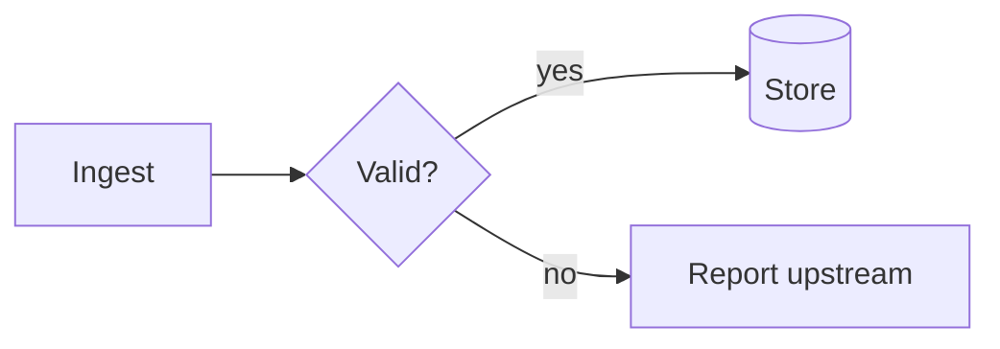
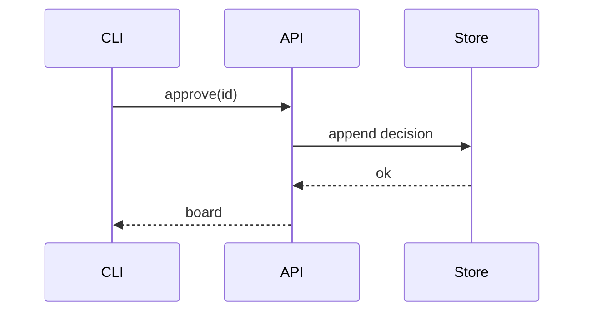
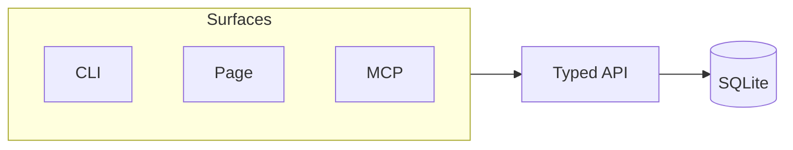

# Design documents

Status: DRAFT — not yet ratified by the owner.
Scope: where design decisions live, how a design doc is written, drafted, ratified and changed, how it is diagrammed, and the durable architecture principles every `*lm` repo follows.

## Layout
- One named document per area: `docs/design/<area>.md`. A decision in a new area gets a new doc and a line in `docs/design/README.md`.
- `docs/design/README.md` = index: one line per doc (name, one-sentence scope, status), plus the legacy-number table if the repo had one.
- `docs/design/glossary.md` = the vocabulary. `docs/design/backlog.md` = unbuilt items. `docs/design/build-order.md` = slice order. `docs/design/assets/` = images only.
- Requirements (the what) live in `docs/requirements/` (see requirements.md); design is the how and why. Work items are GitHub issues (private repo, `gh`), never files in the tree.
- Never create a numbered decision log, `docs/adr/`, `CONTEXT.md`, or `.scratch/`. (Ruled 2026-10-02.)
- A system-overview doc describes how things are now, holds no history, settles nothing; decision docs are authoritative (code: stored schema; glossary: words). On disagreement fix the overview; to change behaviour change the decision doc first.
- Read `docs/design/README.md` and the area's doc before exploring or changing that area.

## Design-doc template
```
# <Area>
Status: DRAFT | RATIFIED <date> (<how: grilling session, PR #>) | BUILT <date>. Replaces: <doc or none>.
Scope: <one line>.
## Decisions
### <Decision as a statement>
<What is decided, concretely: names, numbers, units, file paths.>
**Why:** <incident, measurement, or cost, with numbers>.
**Rules out:** <the alternatives and behaviours this forbids>.
## Boundaries
<What this area will not do / leaves alone.>
## Rejected alternatives
- <Alternative> — rejected <date>: <measured reason>. Do not resurrect without new evidence.
## Open / Unverified
- Open: <question> → issue #<n> labelled `ready-for-human`. Unverified: <fact not yet checked>.
## Built
- Built <YYYY-MM-DD>: <files/functions>. Decisions this slice made that the entries above did not settle: <...>.
## Changes
- <YYYY-MM-DD>: <what changed, why>.
```
- Every setting, verb, or file named gives its location; one not built yet says "(proposed, does not exist yet)" plus the file it would live in. Doc links are relative; code links carry a line anchor. (Ruled 2026-09-25.)
- An amendment names what it supersedes/amends at its top and says BUILT or not. A wrong premise or Built note gets a dated correction, never a silent edit.
- Record gaps and failed attempts found while building, with measurements ("do not re-derive these"); never paper over them.
- Worked examples for any lifecycle or data shape. Cover the cross-cutting concerns the product needs (security, privacy, observability, failure); say when user data leaves the machine.
- A doc-light repo starts with one design doc derived from the code: only what the code shows, open questions marked.

## Lifecycle: DRAFT → ratified → built
1. Draft in `docs/design/<area>.md` marked DRAFT. Do not implement anything before ratification.
2. Grill the owner (`/grilling`): one question at a time, each with your recommended answer and its reason.
3. YAGNI pass: cut every part no current requirement needs; move deferred-but-shaped parts to the backlog.
4. Before ratifying a schema or state file, show 2–3 concrete example rows/files with real-looking values.
5. Thresholds are measured, not guessed: replay real data against a copy of the store and record the numbers in **Why:**. Defaults come from a sweep with a held-out set, not intuition. Calibrate deterministic thresholds against what people already approved, not a reading of formulas; fail only when independent formulas agree. Validate a rule against history (walk-forward) before trusting it; never change scoring inputs without a new validation run.
6. Owner ratifies → status line updated → PRD and GitHub issues cut from the doc's slices; issues cite the doc by name and requirement IDs.
7. After each slice: append a Built note. Change a decision only by editing it in place plus a dated `## Changes` line.
- If work contradicts a ratified decision, say so explicitly and why it is worth reopening; never silently override. Reversing a ratified boundary needs its own grilling before any build.
- Agent doc edits: one section or one new doc per PR, never a whole rewrite. Text narrating a superseded decision is replaced by the current rule plus a pointer, never another layer.

## Backlog and build order
- `docs/design/backlog.md`: each item has a status (`ratified` · `proposed` · `deferred`), names the decision it follows, carries enough context to pick up cold, and a **Done when:** line (checkable); ordered by payoff. Designed far enough to know its shape; built when the need is felt. Speculative features are hypotheses to test with data-driven experiments, not commitments.
- Anything done by hand twice becomes a backlog verb (see `/harvest-tools`). Build in slices, each usable on its own. Order by real dependency (nothing pulled forward), then first real risk; phase N+1 starts only when phase N's features are met; ship the review surface early; prove one target end to end before scaling.
- Retiring a surface: keep the old one as an equal door until the replacement has carried one real session; then one commit retires it and the decision gets a dated Change. One door, not three: remove alternative roads that do not actually work (e.g. an MCP App road dropped for local served pages).
- Automate a sweep only after on-demand findings prove to earn accepts; drop/dismiss rates are the go/no-go signal.

## Diagrams
- Mermaid in fenced blocks by default. GitHub renders natively; Cursor/VS Code needs extension `bierner.markdown-mermaid`, listed in the repo's `.vscode/extensions.json`.
- Required when >3 interacting components or any lifecycle/state machine; supplements text, never replaces it. ≤~12 nodes, else split. Node names are glossary terms. Avoid `block-beta`/`architecture-beta` (beta). ASCII only for ≤3 boxes or code comments.
- Images (SVG/PNG in `docs/design/assets/`) only for UI mockups/screenshots, editable source beside them.

Flow: `flowchart`.

Lifecycle: `stateDiagram-v2` with composite states, `--` parallel regions, choice/fork/join.
```mermaid
stateDiagram-v2
  [*] --> Draft
  Draft --> Review
  state Review {
    [*] --> Grilling --> YagniPass --> [*]
  }
  Review --> Ratified
```
Interaction: `sequenceDiagram`.

System blocks: `flowchart` + `subgraph`.


## Readability
- Lead each decision with the rule as a statement, reasoning in **Why:**. Concrete over abstract: names, numbers with units, paths, an example row.
- Body states the current design only; history lives in `## Changes` and Built notes.
- Tables for attribute → writer → meaning, and for Q → Decision → Consequence when reconciling conflicting docs.
- Statements at different scopes (dev vs prod, v1 vs v2, a stated exception) are not contradictions; label the scope.
- Module docstrings state the module's invariant in paragraph one (→ coding.md for code docs).

## Glossary and naming
- `docs/design/glossary.md`: one word per concept, used in docs, code, tests, config, prompts, messages; no synonyms. A missing concept is invented language or a real gap: add it or ask.
- When a term collides or causes wrong reasoning, rename everywhere and keep a dated old → new rename table. Never recycle a vacated word.
- Name an attribute after the thing it governs, not the machinery that consumes it; verbs by what changes. Never reason from a table/column name; read the docstring and glossary.

## Matt Pocock skill mapping
- `/metalm-setup` replaces `/setup-matt-pocock-skills`. Process skills stay: grilling, tdd, implement, diagnosing-bugs, codebase-design, review, triage, to-issues, to-prd, domain-modeling.
- Where a skill says `CONTEXT.md` → `docs/design/glossary.md`. Where it says ADR / `docs/adr/` → the named doc under `docs/design/` (decision / Why / Rules out + dated Changes).
- Work items: GitHub issues via `gh`, private repo; a repo without a remote gets one created first. `docs/agents/issue-tracker.md` says GitHub.
- Code quality: built-in `/code-review`. Matt `review` only for its spec axis (does the diff do what the issue asked).

## Legacy decision numbers
- Old D-numbers survive only so old citations resolve: `docs/design/README.md` carries a number → document table; moved headings end "(was D7)"; old `docs/design-decisions.md` becomes a pointer to it. Code comments citing D-numbers stay valid; new code cites the document by name.

## Reviewing a design
- Be blunt: say where a practice is contested or a principle fails; give concrete counterexamples.
- Judge against the product's own drivers via scenarios; "unsound" = a scenario the product will meet that a quoted decision mishandles. No taste findings.
- Priority: two docs contradicting on a core rule; a stated invariant ("always", "never", "exactly one") broken elsewhere; retry of a non-idempotent write without an idempotency key; secrets in the clear; unbounded queue/fan-out; a single point of failure on a depended-on path.
- A missing rationale matters only where a reader could plausibly undo the decision and break something.
