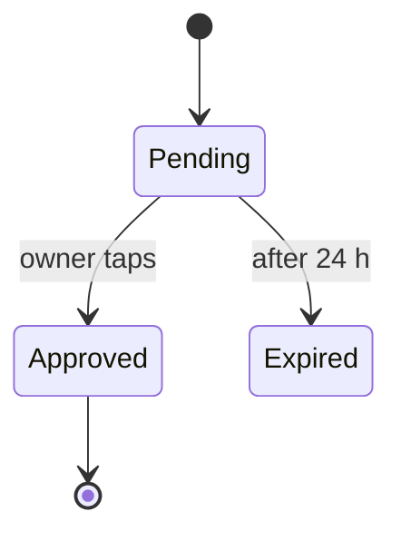

# Design

Status: DRAFT — not yet ratified by the owner. Rules marked `(owner)` are the owner's.
Scope: where design decisions live (in the code), how they are written, decided and changed, generated docs, diagrams, and reviewing a design.

## Where decisions live
- The code is the design. A decision that concerns one class, module or test is that code; record it nowhere else. (owner)
- A reason that concerns one module goes in that module's docstring, next to the code it explains. (owner)
- A decision that spans several parts of the code lives once, inline, as a rule in the docstring of the package that owns it. (owner)
- One answer per question. An overruled decision is replaced in place, and every older answer is deleted from docs and code. No Changes lines, no dates, no superseded text: git keeps the history. (owner)
- The owner's decisions end with `(owner)`. Text without it is agent-drafted and agents may change it. Only the owner adds or removes `(owner)`; an agent writes it only on a ruling the owner gave in chat, in the same PR that deletes the older answers. (owner)
- An `(owner)` rule names the test that enforces it where one can: `Enforced by: tests/test_x.py::test_y`.
- `docs/design/<area>.md` holds only decisions no code in the repo owns: what it assumes about other repos, outside services, and data at rest. Same rules: one place, inline, `(owner)`. Most repos have none. (owner)
- A rule shared by repos lives in metalm, or in the docstring of the library that owns the shared thing (a shared database: its schema-owner library). An operational decision lives as a comment in the script or plist that carries it out. (owner)
- Plans, backlog and unbuilt work are GitHub issues, never files.
- Never create a numbered decision log, `docs/adr/`, `CONTEXT.md`, `.scratch/`, `backlog.md`, or a hand-kept area list.

## The package docstring
The area doc is the package's own documentation slot: Python `src/<pkg>/<area>/__init__.py`; Node/TS the folder's `index.ts` `@packageDocumentation`; Swift the target's DocC catalog; Go `doc.go`; Rust `//!`. (owner)
```python
"""<Area>: <one sentence: what it is for>.

<Its invariant, and what it owns: data, files, tables. Readable in under a minute.>

Never imports: <areas> (enforced by the import contract "<name>" in pyproject.toml).

Decisions:
- <The rule as a statement.> Why: <incident, measurement or cost>. Enforced by: tests/test_x.py::test_y. (owner)

Terms:
- **<term>**: <definition, one meaning>.
"""
```
- Module map: prefer an import contract where the language or its open-source ecosystem has one (Python `import-linter`, contracts in `pyproject.toml`; Node `dependency-cruiser`; Swift, Go, Rust: the module system). Otherwise write `Never imports:` in the docstring. The contract runs in the test suite. (owner)
- A term is defined in the docstring of the package that owns it; a term several packages use belongs to the package that defines its data. (owner)
- Name settings, verbs and files with their location (file path, line for code).

## Generated docs
- Every repo generates its docs from code into `docs/generated/`, committed to git; nobody edits them by hand. (owner)
- Files: `index.md` (every area: name, paragraph one, never-imports), `decisions.md` (every `(owner)` rule with its package), `glossary.md` (every `Terms:` entry), `cujs.md` (every CUJ with the test that proves it; requirements.md). Plus the language's API reference where its generator writes Markdown.
- Generator: metalm's `metalm-gendocs` pre-commit hook (`.pre-commit-hooks.yaml`, `src/metalm_gendocs/`). It reads Python docstrings and `cuj` markers, and, when the repo has a root `package.json`, TypeScript/JavaScript `@packageDocumentation` blocks and `// cuj:` comments; it imports nothing. `metalm-gendocs --check` is the staleness test. Config: `[tool.metalm-gendocs]` keys `src`, `tests`, `out` in `pyproject.toml`. A repo may add its language's API reference (TypeDoc with `typedoc-plugin-markdown`, DocC, `rustdoc`).
- Languages it does not read are listed under "Not covered" in `docs/generated/index.md`. An agent that sees one asks the owner whether to add it; on yes it files a metalm issue naming the language's doc-comment convention, test framework and the repo, and the generator grows to cover it. (owner)
- Repos pin the hook by `rev` (pre-commit requires it, so a metalm change never alters every repo's commits at once): a metalm commit SHA. `pre-commit autoupdate --bleeding-edge` moves it to metalm's latest `main`; `metalm-setup` runs it when metalm changed.
- Three layers keep them current with no step from the owner (owner):
  1. Pre-commit hook regenerates on every commit that changes code; when files changed the commit stops; add them and commit again.
  2. GitHub Action on every PR runs the hooks and pushes a regenerated commit to the PR branch.
  3. A test fails when regenerating would change `docs/generated/`.
- Agents may commit, approve and merge a commit or PR whose only changes are under `docs/generated/`. (owner)
- Finding a repo's areas: read `docs/generated/index.md`; if missing, list `src/<pkg>/*/__init__.py` and read paragraph one of each. (owner)

## Deciding
- Grill the owner (`/grilling`) before a decision that spans modules or is hard to reverse: one question at a time, each with a recommendation. A small reversible change goes straight to code and a test.
- YAGNI pass: cut every part no current CUJ or issue needs.
- Before deciding a schema or state file, show 2–3 example rows with real-looking values.
- Thresholds are measured, not guessed: replay real data against a copy of the store and put the numbers in **Why**. Defaults come from a sweep with a held-out set. Validate a rule against history before trusting it.
- Work that contradicts an `(owner)` rule: say so and why it is worth reopening; never override silently.
- Record gaps and failed attempts found while building, with measurements, in the docstring of the code they concern.
- Cover the cross-cutting concerns the product needs (security, privacy, observability, failure); say where user data leaves the machine.

## Diagrams
- Mermaid in fenced blocks, in docstrings or `docs/design/`; the generated Markdown carries them through and GitHub renders them. Editors need `bierner.markdown-mermaid` (in `.vscode/extensions.json`).
- Required when >3 interacting components or any lifecycle/state machine; supplements text, never replaces it. ≤~12 nodes, else split. Node names are glossary terms. No `block-beta`/`architecture-beta`. ASCII only for ≤3 boxes.
- Flow: `flowchart`; lifecycle: `stateDiagram-v2`; interaction: `sequenceDiagram`; system blocks: `flowchart` + `subgraph`.

- Images (SVG/PNG in `docs/design/assets/`) only for UI mockups and screenshots, editable source beside them.

## Readability
- Lead with the rule as a statement, reasoning after **Why:**. Concrete over abstract: names, numbers with units, paths, an example row.
- State rules as what to do; use "never" only for a real hazard, with its reason.
- Statements at different scopes (dev vs prod, a stated exception) are not contradictions; label the scope.
- One word per concept in docs, code, tests, config and prompts; no synonyms. A missing term is invented language or a gap: add it to the owning docstring or ask. Never recycle a vacated word.
- Name an attribute after the thing it governs, not the machinery that consumes it; verbs by what changes.

## Matt Pocock skill mapping
- `/metalm-setup` is the setup skill. Process skills: grilling, tdd, implement, diagnosing-bugs, codebase-design, review, triage, to-issues, domain-modeling.
- A skill that says `CONTEXT.md`: read `docs/generated/glossary.md`; add or change a term in the owning package's `Terms:`.
- A skill that says ADR or `docs/adr/`: an `(owner)` rule in the owning package docstring. A skill that writes a PRD: a GitHub issue.
- Work items: GitHub issues via `gh`; a repo without a remote gets one first. `docs/agents/issue-tracker.md` says GitHub.
- Code quality: built-in `/code-review`. Matt `review` only for its spec axis (does the diff do what the issue asked).

## Moving a repo to docs in code (owner)
One migration issue per repo, area by area; repos under active change first.
1. Each area's purpose and module map move into its package docstring; the map into an import contract where supported.
2. Only rules already marked as the owner's ("Ruled …", ratified) become `(owner)`. Every other rule is enforced by code or a test, or deleted.
3. Where a ruling was overruled, only the latest survives; the PR lists every conflict settled.
4. `docs/requirements/` is replaced by generated CUJs once the e2e tests carry `cuj` markers. A requirement with no test becomes a `ready-for-human` issue: build a test, or drop it.
5. Each PR deletes what it replaces. The PR body lists every promoted `(owner)` rule and settled conflict: that is the owner's review.
- Old D-numbers cited in code: replace with the package name in the same PR.

## Reviewing a design
- Be blunt: say where a practice is contested or a principle fails; give concrete counterexamples.
- Judge against the product's own drivers via scenarios; "unsound" = a scenario the product will meet that a quoted decision mishandles. No taste findings.
- Priority: two `(owner)` rules that contradict; an overruled answer still written somewhere; a stated invariant ("always", "exactly one") broken elsewhere; a docs-recorded decision that concerns one module (belongs in the code); retry of a non-idempotent write without an idempotency key; secrets in the clear; unbounded queue or fan-out; a single point of failure on a depended-on path.
- A missing rationale matters only where a reader could plausibly undo the decision and break something.
