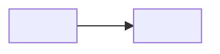

# <Area> design

Status: DRAFT — not yet ratified by the owner.

Requirements: [../requirements/<area>.md](../requirements/<area>.md)

## <Decision title>

<What is decided, in 1–5 bullets.>

**Why:** <reason>.

**Rules out:** <alternatives this excludes>.

## Rejected alternatives

- <Alternative> — <reason>. Do not resurrect without new evidence.

## Changes

- <YYYY-MM-DD> Created.
